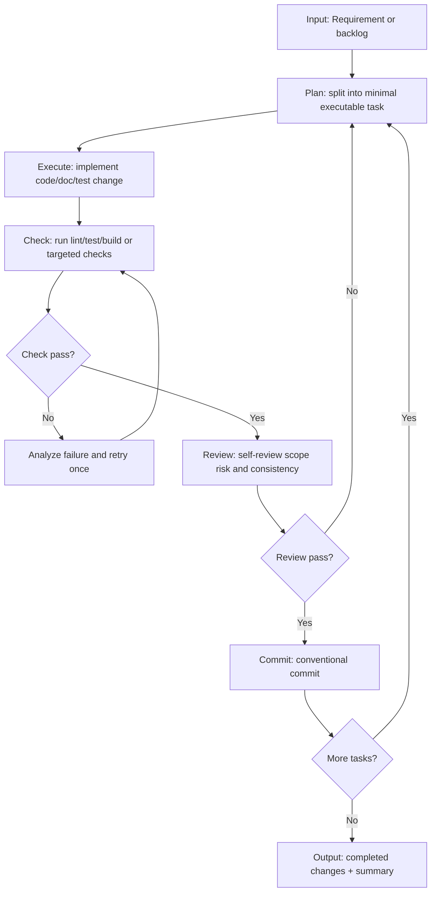
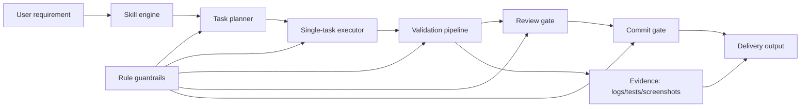

# show-me-code-autopilot

English | [中文](./README.zh-CN.md)

This project focuses on one thing: turning large requirements into small, safe, continuously shippable tasks through an autopilot loop.

## Technical Approach

- **Two-layer control model**
  - `Skill` handles strategy and execution orchestration.
  - `Rule` enforces hard constraints and stop conditions.
- **Small-batch delivery**
  - Each loop only handles one minimal sub-task.
  - No "big-bang" refactor in a single round.
- **Evidence-driven quality**
  - Every loop must include verification output.
  - Commit is allowed only after `check + review` pass.
- **Deterministic stop policy**
  - Stop after repeated failures or no executable task.
  - Return blockers and current state to user.

## End-to-End Delivery Flow

## Implementation Principle Diagram

## Practical Landing Process

1. Provide a clear backlog (priority + expected result).
2. Start autopilot and force one-task-per-loop execution.
3. Keep each loop independently verifiable.
4. Merge only loops with clear evidence and low regression risk.
5. Stop immediately when guardrails are hit and output a blocker report.

## Scope and Non-goals

- This is an execution protocol, not a full external workflow scheduler.
- It optimizes continuous delivery speed under controlled risk.
- It does not replace product decisions when requirements conflict.
# show-me-code-autopilot
