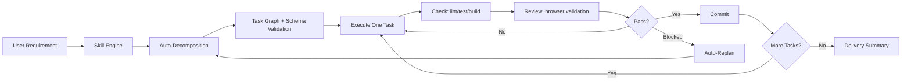

# show-me-code-autopilot

[English](./README.md) | [中文](./README.zh-CN.md)

A Claude Code skill that turns large requirements into small, safe, continuously shippable tasks through autonomous iterative delivery loops.

> **One requirement. Infinite loops. Zero manual overhead.**

## Features

- **Auto-Decomposition** - Automatically break down requirements into validated task graphs with proper dependencies
- **Schema Validation** - Enforce complete task definitions with required fields for consistency
- **Research Decision Matrix** - Explicit rules determine when research is needed, avoiding unnecessary delays
- **Progress Visualization** - Visual progress tracking with bars, icons, and dependency graphs

## Quick Start

```bash
# 1. Install the skill
cp -r skills/show-me-code-autopilot ~/.claude/skills/

# 2. Use in Claude Code
Enable show-me-code-autopilot mode.
Run loop: plan -> execute -> check -> review -> commit.
Continue until backlog is complete.
```

## How It Works



## The Loop: PLAN → EXECUTE → CHECK → REVIEW → COMMIT

### 1. PLAN (Enhanced)

**Auto-Decomposition**: If no backlog exists, automatically break down requirements into tasks using decomposition patterns (CRUD, Authentication, UI Components, API Integration).

**Schema Validation**: Every task must include:
- `id` (TASK-XXX format)
- `title` (action statement)
- `state` (todo|doing|blocked|done)
- `depends_on` (array)
- `acceptance` (testable conditions)
- `risk` (low|medium|high)
- `files_hint` (expected files)

**Select Task**: Pick one task from ready queue (all dependencies done).

### 2. RESEARCH (Explicit Triggers)

Research is ONLY required for:
- ✅ New library/framework/tool
- ✅ Architecture changes
- ✅ Implementation uncertainty (>2 options)
- ❌ NOT for: CRUD, bug fixes, style changes

### 3. EXECUTE

- Keep changes focused on required files only
- Avoid speculative refactors
- Keep functions small and reusable

### 4. CHECK

Run all relevant project checks:
- lint
- tests
- build/typecheck

Fix and retry until pass.

### 5. REVIEW (For UI/flow changes)

Use MCP browser tools and/or Playwright to validate:
- page load success
- key interaction path works
- expected state is visible

### 6. COMMIT

Commit only when:
- ✅ checks passed
- ✅ review passed
- ✅ acceptance criteria met

Update task status to `done` and continue to next task.

## Project Structure

```
skills/show-me-code-autopilot/
├── SKILL.md                           # Main skill definition
├── references/                        # Documentation
│   ├── decomposition-patterns.md      # Task breakdown patterns
│   ├── planning_task-decomposition.md # Task schema reference
│   ├── progress-template.md           # Progress visualization guide
│   └── validation_quality-gates.md    # Quality gate definitions
└── templates/                         # Runtime file templates
    ├── backlog.md.template
    ├── progress.md.template
    └── decision-log.md.template
```

## Runtime Artifacts

The skill creates and maintains these files in your project's `.autopilot/` directory:

| File | Purpose |
|------|---------|
| `backlog.md` | Task graph with states and dependencies |
| `progress.md` | Per-loop execution log with visualization |
| `decision-log.md` | Research and technical decisions |

## Example Progress Visualization

```
Overall Progress: [████████░░] 80% (4/5 tasks complete)

Status Summary:
| Status | Count | Tasks |
|--------|-------|-------|
| ✅ Done | 4 | TASK-001, TASK-002, TASK-004, TASK-005 |
| 🔄 In Progress | 1 | TASK-003 |
| ⏳ Todo | 0 | - |
| 🚫 Blocked | 0 | - |

Task Dependency Graph:
TASK-001 (✅) ──► TASK-002 (✅) ──► TASK-003 (🔄)
     │
     └──────────────► TASK-004 (✅)
```

## Usage Example

```bash
# Simple prompt to Claude Code:
Enable show-me-code-autopilot mode.
Run autonomous loops until complete.
Requirement: Implement user authentication with JWT.
```

The skill will:
1. Auto-decompose into 4-6 tasks
2. Execute each task with validation
3. Commit after each successful loop
4. Stop when complete or blocked

## Technical Approach

- **Two-layer control model**
  - `Skill` handles strategy and execution orchestration
  - `Rule` enforces hard constraints and stop conditions
- **Small-batch delivery**
  - Each loop handles one minimal sub-task
  - No "big-bang" refactor in a single round
- **Evidence-driven quality**
  - Every loop includes verification output
  - Commit allowed only after `check + review` pass
- **Deterministic stop policy**
  - Stop after repeated failures or no executable task
  - Return blockers and current state to user

## Scope and Non-goals

- ✅ This is an execution protocol for autonomous coding
- ✅ Optimizes continuous delivery speed under controlled risk
- ❌ Does not replace product decisions when requirements conflict
- ❌ Not a full external workflow scheduler

## Documentation

- [Skill Definition](./skills/show-me-code-autopilot/SKILL.md)
- [Decomposition Patterns](./skills/show-me-code-autopilot/references/decomposition-patterns.md)
- [Progress Visualization Guide](./skills/show-me-code-autopilot/references/progress-template.md)
- [Quality Gates](./skills/show-me-code-autopilot/references/validation_quality-gates.md)

## License

MIT
