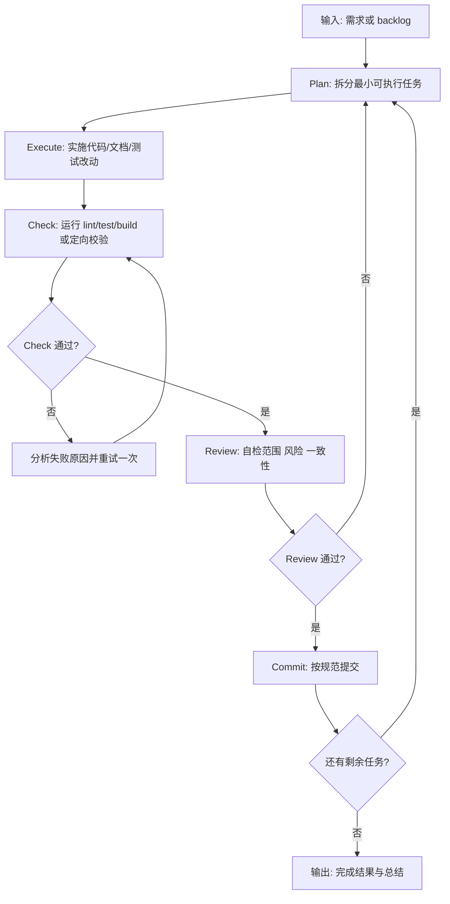
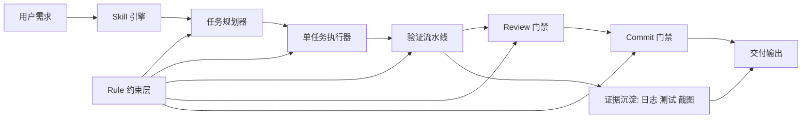

# show-me-code-autopilot

[English](./README.md) | 中文

这个项目只解决一件事：把大需求拆成小步可落地任务，通过 autopilot 循环持续、安全地交付。

## 技术思路

- **双层控制模型**
  - `Skill` 负责策略编排与执行驱动。
  - `Rule` 负责硬边界、门禁和停止条件。
- **小步快跑交付**
  - 每一轮只处理一个最小子任务。
  - 避免单轮大爆改导致风险失控。
- **证据驱动质量**
  - 每轮都要产出可验证结果。
  - 仅在 `check + review` 通过后允许提交。
- **确定性停止策略**
  - 连续失败或无可执行任务即停止。
  - 输出阻塞点和当前状态给用户。

## Skill 整体流程图

## 实现原理图

## 落地流程方案

1. 输入清晰 backlog（优先级 + 预期结果）。
2. 启动 autopilot，强制单轮单任务推进。
3. 每轮都必须做到“可独立验证”。
4. 仅合并有证据且回归风险可控的改动。
5. 命中边界条件立即停止并输出阻塞报告。

## 适用边界

- 这是执行协议，不是完整的外部工作流调度器。
- 目标是“可控风险下的持续交付速度”。
- 当需求冲突时，仍需要人工做产品决策。
