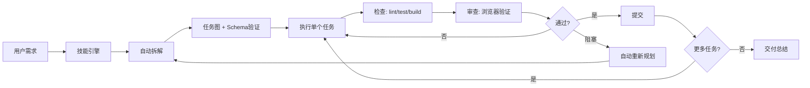

<p align="center">
  
</p>

<h1 align="center">Hepha</h1>

<p align="center">
  <a href="./README.md">English</a> | <a href="./README.zh-CN.md">中文</a>
</p>

<p align="center">
  一个 Agent 技能，通过自主迭代交付循环将大需求拆解为小而安全、可持续交付的任务。
</p>

<p align="center"><strong>"少废话，看代码。"</strong></p>

---

## 起源

Hepha 脱胎于希腊工匠之神 Hephaestus。它不再是单纯的工具，而是一个在数字熔炉中为你锻造逻辑的工匠。

在 AI 的世界里，想法往往转瞬即逝。Hepha 的使命是捕捉这些灵感的火花，通过精准的打击（Striking）和打磨，迅速将其转化为结构严谨、可执行的代码。

## 信条

> "少废话，看代码。"

Hepha 沉默寡言，但执行力极强。它不进行无谓的闲聊，只专注于为你提供即时的、所见即所得的（WYSIWYG）代码产出。

ClawHub：https://clawhub.ai/melonlee/hepha-skill

## 愿景

我们希望 Hepha 成为你开发工作流中的"轴心"（Axis）。当你拥有一个想法、一个 UI 草图或一段复杂的业务逻辑时，只需将其交给 Hepha。它将确保从构思到代码的跨越过程就像金属在火神铁砧上成型一样，精准、优雅且富有质感。

## 核心功能

- **自动拆解** - 使用验证模式自动将需求分解为带依赖关系的任务图
- **Schema 验证** - 强制完整的任务定义以确保一致性
- **研究决策矩阵** - 明确的规则判断何时需要研究，避免不必要的延误
- **进度可视化** - 可视化进度跟踪，包含进度条、图标和依赖关系图

## 快速开始

```bash
# 1. 安装技能
cp -r skills/hepha ~/.claude/skills/

# 2. 在你的 Agent 中启用
启用 hepha 模式。
运行循环：plan -> execute -> check -> review -> commit。
持续直到 backlog 完成。
```

## 工作原理



## 循环流程：PLAN → EXECUTE → CHECK → REVIEW → COMMIT

### 1. PLAN (增强版)

**自动拆解**：如果不存在 backlog，使用拆解模式（CRUD、认证、UI 组件、API 集成）自动将需求分解为任务。

**Schema 验证**：每个任务必须包含：
- `id` (TASK-XXX 格式)
- `title` (动作陈述)
- `state` (todo|doing|blocked|done)
- `depends_on` (数组)
- `acceptance` (可测试的条件)
- `risk` (low|medium|high)
- `files_hint` (预期文件)

**选择任务**：从就绪队列中选择一个任务（所有依赖已完成）。

### 2. RESEARCH (明确触发条件)

**仅在以下情况需要研究**：
- ✅ 新的库/框架/工具
- ✅ 架构变更
- ✅ 实现不确定（>2 个方案）
- ❌ 不需要：CRUD 操作、Bug 修复、样式调整

### 3. EXECUTE

- 仅修改必需的文件
- 避免推测性重构
- 保持函数小而可复用

### 4. CHECK

运行所有相关的项目检查：
- lint
- tests
- build/typecheck

修复并重试直到通过。

### 5. REVIEW (针对 UI/流程变更)

使用 MCP 浏览器工具和/或 Playwright 验证：
- 页面加载成功
- 关键交互路径正常
- 预期状态可见

### 6. COMMIT

仅在以下情况提交：
- ✅ 检查通过
- ✅ 审查通过
- ✅ 验收标准满足

更新任务状态为 `done`，继续下一个任务。

## 项目结构

```
skills/hepha/
├── SKILL.md                           # 主技能定义
├── references/                        # 文档
│   ├── decomposition-patterns.md      # 任务拆解模式
│   ├── planning_task-decomposition.md # 任务 Schema 参考
│   ├── progress-template.md           # 进度可视化指南
│   └── validation_quality-gates.md    # 质量门槛定义
└── templates/                         # 运行时文件模板
    ├── backlog.md.template
    ├── progress.md.template
    └── decision-log.md.template
```

## 运行时产物

技能在项目的 `.hepha/` 目录中创建并维护以下文件：

| 文件 | 用途 |
|------|------|
| `backlog.md` | 带状态和依赖的任务图 |
| `progress.md` | 带可视化的每轮执行日志 |
| `decision-log.md` | 研究和技术决策 |

## 进度可视化示例

```
Overall Progress: [████████░░] 80% (4/5 tasks complete)

Status Summary:
| Status | Count | Tasks |
|--------|-------|-------|
| ✅ Done | 4 | TASK-001, TASK-002, TASK-004, TASK-005 |
| 🔄 In Progress | 1 | TASK-003 |
| ⏳ Todo | 0 | - |
| 🚫 Blocked | 0 | - |

Task Dependency Graph:
TASK-001 (✅) ──► TASK-002 (✅) ──► TASK-003 (🔄)
     │
     └──────────────► TASK-004 (✅)
```

## 使用示例

```bash
# 发送简单提示：
启用 hepha 模式。
运行自主循环直到完成。
需求：实现基于 JWT 的用户认证。
```

技能将：
1. 自动拆解为 4-6 个任务
2. 执行每个任务并进行验证
3. 每次成功循环后提交
4. 完成或阻塞时停止

## 技术方案

- **双层控制模型**
  - `Skill` 负责策略编排与执行驱动
  - `Rule` 负责硬边界、门禁和停止条件
- **小步快跑交付**
  - 每轮只处理一个最小子任务
  - 避免单轮大爆改导致风险失控
- **证据驱动质量**
  - 每轮都要产出可验证结果
  - 仅在 `check + review` 通过后允许提交
- **确定性停止策略**
  - 连续失败或无可执行任务即停止
  - 输出阻塞点和当前状态给用户

## 适用边界

- ✅ 这是自主编码的执行协议
- ✅ 目标是"可控风险下的持续交付速度"
- ❌ 需求冲突时不替代产品决策
- ❌ 不是完整的外部工作流调度器

## 文档

- [技能定义](./skills/hepha/SKILL.md)
- [拆解模式](./skills/hepha/references/decomposition-patterns.md)
- [进度可视化指南](./skills/hepha/references/progress-template.md)
- [质量门槛](./skills/hepha/references/validation_quality-gates.md)

## 许可证

MIT
