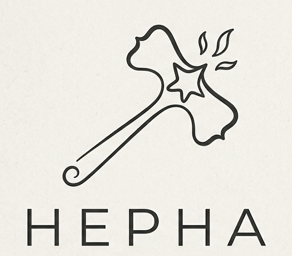
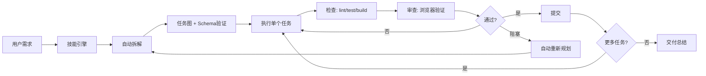

# Hepha

<p align="center">
  
</p>

<p align="center">
  <a href="./README.md">English</a> | <a href="./README.zh-CN.md">中文</a>
</p>

<p align="center">

[](https://github.com/melonlee/Hepha/stargazers)
[](https://opensource.org/licenses/MIT)
[](https://docs.claude.com/claude-code)
[](https://clawhub.ai/melonlee/hepha-skill)

</p>

<p align="center">
  <strong>通过自主迭代交付循环，将大需求拆解为小而安全、可持续交付的任务。</strong>
</p>

<p align="center">

[功能介绍](#功能介绍) · [快速开始](#快速开始) · [工作原理](#工作原理) · [效果演示](#效果演示) · [文档](#文档) · [更新日志](#更新日志)

</p>

---

## ⭐ 为什么用 Hepha？

如果你曾经试过给 AI Agent 一个大需求，然后看着它跑偏、产生一堆难以维护的代码，最后花的时间比手动写还多 — Hepha 就是为你设计的。

Hepha 强制执行**纪律严明的循环**：PLAN → EXECUTE → CHECK → REVIEW → COMMIT。每个任务在进入代码库前都要经过验证。每次提交都是最小化的、安全的。

> **"少废话，看代码。"** — Hepha 的信条

### 你将获得

- 🚀 **自主交付** — 一个提示词，持续提交直到完成
- 🛡️ **风险可控** — 每轮只交付一个最小、经过验证的任务
- 📊 **进度透明** — 实时任务图 + 进度条
- 🔍 **证据驱动** — 每次提交都必须通过检查 + 浏览器验证
- 🔄 **自我修正** — 被阻塞时自动重新规划，只在真正必要时才提问

---

## 功能介绍

| 功能 | 说明 |
|------|------|
| **自动拆解** | 将大需求自动拆解为带依赖关系的验证任务图 |
| **Schema 验证** | 强制要求每个任务包含完整字段：id、title、state、depends_on、acceptance、risk、files_hint |
| **研究决策矩阵** | 明确规则：只在真正需要时研究（新库、架构变更、多方案），CRUD/改Bug/样式调整不需要研究 |
| **进度可视化** | Markdown 进度条、状态表、任务依赖图，实时更新 |
| **双层控制** | `Skill` 负责策略编排；`Rule` 强制硬边界和停止条件 |
| **确定性停止策略** | 连续失败或无执行任务时自动停止；清晰报告阻塞点和当前状态 |

---

## 快速开始

```bash
# 1. 将 skill 复制到你的 Claude Code / OpenClaw skills 目录
cp -r skills/hepha ~/.claude/skills/

# 2. 一个提示词激活 Hepha 模式
启用 hepha 模式。
运行循环：plan -> execute -> check -> review -> commit。
持续直到 backlog 完成。
需求：<在这里粘贴你的需求>
```

就这样。Hepha 会：
1. 分析你的需求并自动拆解成任务图
2. 每次只执行一个任务，通过完整验证循环
3. 每次成功循环后提交
4. 全部任务完成或触发停止条件时停止

---

## 工作原理



### 循环流程：PLAN → EXECUTE → CHECK → REVIEW → COMMIT

#### 1. PLAN
- **自动拆解**：若 backlog 不存在，使用拆解模式（CRUD、认证、UI 组件、API 集成）自动将需求分解为任务
- **Schema 验证**：每个任务必须包含：`id`、`title`、`state`、`depends_on`、`acceptance`、`risk`、`files_hint`
- **选择任务**：从就绪队列中选择（所有依赖都已完成）

#### 2. RESEARCH（研究）
**仅在以下情况需要研究**：
- ✅ 新库/框架/工具
- ✅ 架构变更
- ✅ 实现不确定（>2 个方案）
- ❌ 不需要：CRUD、Bug 修复、样式调整

#### 3. EXECUTE（执行）
- 仅修改必需的文件
- 避免推测性重构
- 保持函数小而可复用

#### 4. CHECK（检查）
运行所有相关的项目检查：
```
lint → tests → build/typecheck
```
修复并重试直到通过。

#### 5. REVIEW（审查）
针对 UI/流程变更，使用 MCP 浏览器工具或 Playwright 验证：
- 页面加载成功
- 关键交互路径正常
- 预期状态可见

#### 6. COMMIT（提交）
仅在以下情况提交：
- ✅ 检查通过
- ✅ 审查通过
- ✅ 验收标准满足

---

## 效果演示

### 使用前后对比

| 不用 Hepha | 使用 Hepha |
|-----------|-----------|
| 一个大提示词，输出不可预测 | 一个提示词，结构化自主循环 |
| 进度不透明 | 实时任务图 + 进度条 |
| 大范围高风险提交 | 每轮小步提交，每次都经过验证 |
| 容易跑偏 | 被阻塞时自动重新规划 |
| 无质量证据 | 每次提交都有检查 + 审查证据 |

### 实时进度示例

```
Overall Progress: [████████░░] 80% (4/5 tasks complete)

Status Summary:
| Status        | Count | Tasks                            |
|---------------|-------|----------------------------------|
| ✅ Done        | 4     | TASK-001, 002, 004, 005          |
| 🔄 In Progress | 1     | TASK-003                         |
| ⏳ Todo        | 0     | -                                |
| 🚫 Blocked    | 0     | -                                |

Task Dependency Graph:
TASK-001 (✅) ──► TASK-002 (✅) ──► TASK-003 (🔄)
     │
     └──────────────► TASK-004 (✅)
```

### 使用示例

```bash
# 提示词：
启用 hepha 模式。
运行自主循环直到完成。
需求：实现基于 JWT 的用户认证。
```

技能将：
1. 自动拆解为 4-6 个任务（如 TASK-001：数据库Schema、TASK-002：认证中间件、TASK-003：登录API、TASK-004：前端登录表单、TASK-005：JWT 验证）
2. 每个任务都通过验证循环执行
3. 每次成功循环后提交
4. 完成或阻塞时停止

---

## 项目结构

```
skills/hepha/
├── SKILL.md                           # 主技能定义（用于 Claude Code / OpenClaw）
├── references/                        # 文档
│   ├── decomposition-patterns.md      # 任务拆解模式
│   ├── planning_task-decomposition.md # 任务 Schema 参考
│   ├── progress-template.md           # 进度可视化指南
│   └── validation_quality-gates.md    # 质量门槛定义
└── templates/                         # 运行时文件模板
    ├── backlog.md.template             # 任务图模板
    ├── progress.md.template           # 进度日志模板
    └── decision-log.md.template       # 研究日志模板
```

## 运行时产物

Hepha 在项目 `.hepha/` 目录中创建并维护以下文件：

| 文件 | 用途 |
|------|------|
| `backlog.md` | 带状态、依赖和风险级别的任务图 |
| `progress.md` | 每轮执行日志，含证据和进度可视化 |
| `decision-log.md` | 研究和技术决策，含权衡分析 |

---

## 技术方案

- **双层控制模型**
  - `Skill` 负责策略编排与执行驱动
  - `Rule` 强制硬边界、门禁和停止条件
- **小步快跑交付**：每轮只处理一个最小子任务，避免单轮大爆改导致风险失控
- **证据驱动质量**：每轮都要产出可验证结果；仅在 `check + review` 通过后允许提交
- **确定性停止策略**：连续失败或无可执行任务时停止；报告阻塞点和当前状态

## 适用边界

- ✅ 这是自主编码的**执行协议**
- ✅ 目标是"可控风险下的**持续交付速度**"
- ❌ 需求冲突时**不替代**产品决策
- ❌ **不是**完整的外部工作流调度器

---

## 文档

- [技能定义](./skills/hepha/SKILL.md)
- [拆解模式](./skills/hepha/references/decomposition-patterns.md)
- [进度可视化指南](./skills/hepha/references/progress-template.md)
- [质量门槛](./skills/hepha/references/validation_quality-gates.md)
- [ClaWHub 主页](https://clawhub.ai/melonlee/hepha-skill)

---

## 更新日志

### v1.0.0 (2026-03-28)
- 首次发布
- 自动拆解 + 任务图生成
- PLAN → EXECUTE → CHECK → REVIEW → COMMIT 循环
- 所有任务的 Schema 验证
- 研究决策矩阵
- Markdown 进度条和依赖图可视化
- 运行时产物：backlog.md、progress.md、decision-log.md
- 中英双语支持

---

## 许可证

MIT

<p align="center">
  Hepha — 为相信<strong>证据而非承诺</strong>的开发者而建。
</p>
